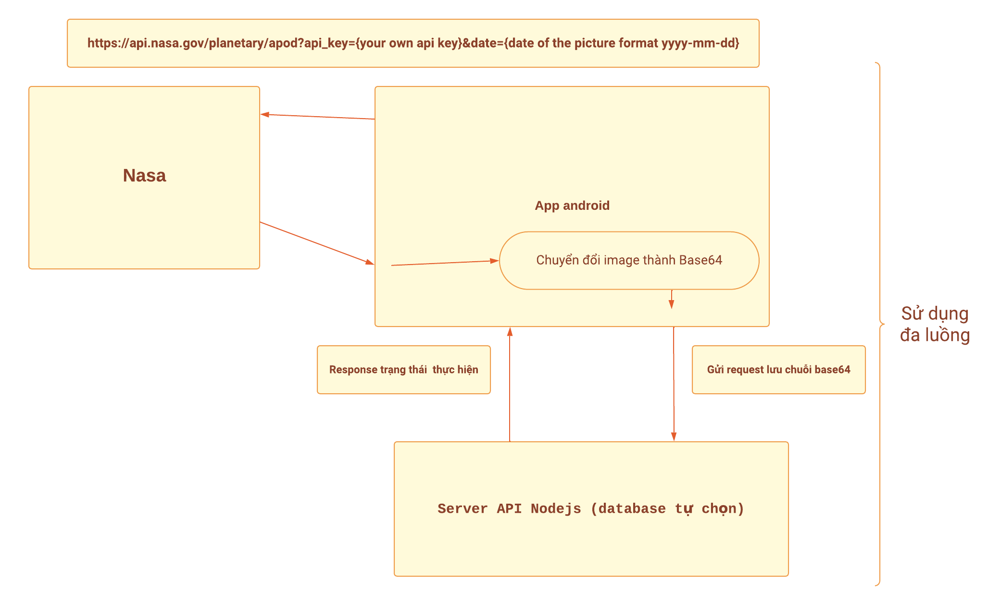
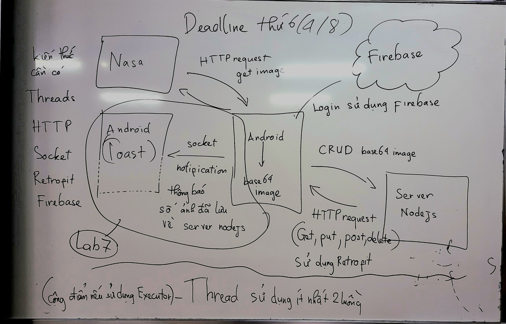

<h2> Lab 1: Tìm chuỗi ký tự input của hàm hashing </h2>


```string
e914b8ce50478823c3fac9d3740446ff51b60af7081f9f2ed0b80055b2d14761
```
Chú ý:
 - Các ký tự trong chuỗi là chữ cái (chữ thường), không bao gồm các ký tự đặc biệt, số và chữ viết hoa. (a-z)
- Chuỗi ký tự có độ dài 5 ký tự.
- Chuỗi ký tự có thể có các ký tự trùng lặp.
- Phải sử dụng thread trong Java để xử lý đề bài (phải có tối thiểu 3 threads)

<h2> Lab 1 (Alternative): Tính tổng toàn bộ các số nguyên tố từ 1 -> 1,000,000  </h2>
Chú ý:
- Phải sử dụng thread trong Java để xử lý đề bài (phải có tối thiểu 3 threads)

<hr/>

<h2> Lab 2: Sử dụng AsyncTask và Handler tìm chuỗi ký tự input của hàm hashing </h2>

```string
a918c858d2dd1a3c69163267468804bdcd67daf50de8899183efe63e8412438a
```

<hr/>

<h2> Lab 3: Sử dụng Demo bài HttpRequestJSON, hoàn thành các phần TODO </h2>

<hr/>

<h2> Lab 4: Sử dụng Demo bài hackingNasaServer, hoàn thành các phần TODO </h2>

<hr/>

<h2>Assignment Part1: Kết hợp tất cả các bài lab và thực hiện nhiệm vụ như mô hình dưới </h2>



<b> Chú ý </b>:
- Phải sử dụng đa luồng để get image, tạo base64 và gửi post request lưu ảnh vào server api Nodejs.
- Khuyến khích sử dụng Retrofit để thực hiện post request và executor để thực hiện đa luồng.
- Có thể đăng ký api key tại https://api.nasa.gov/ để sử dụng api của NASA.

<hr/>

<h2>Lab 5: Sử dụng code mẫu JavaSocketExample để triển khai 2 app android java gửi message cho nhau </h2>
 
<hr/>

<h2>Lab 6: Sử dụng firebase để phát triển tính năng đăng nhập </h2>
Tài liệu tham khảo tại <a href="https://viblo.asia/p/su-dung-firebase-trong-viec-dang-nhap-va-xac-thuc-dang-ky-thanh-vien-MLzGOxlLepq">ĐÂY</a>
 
<h2>Lab 7: Tạo 2 ứng dụng android và sử dụng socket gửi thông từ app A sang app B, app B hiển thị thông báo dạng popup (toast,... ) </h2>

<hr/>

<h2>Assignment GĐ2: Hoàn thiện ứng dụng kéo dữ liệu Nasa theo mô hình <a href="./AssignmentHelper/assignmentGD2.jpg"> NÀY </a> </h2>



<b>Chú ý:</b>
- Phải sử dụng đa luồng để get image, tạo base64 và gửi post request lưu ảnh vào server api Nodejs.
- Khuyến khích sử dụng Retrofit để thực hiện post request và executor để thực hiện đa luồng.
- Có thể đăng ký api key tại https://api.nasa.gov/ để sử dụng api của NASA.
- Code cần có sự đầu tư chuẩn chỉnh về mặt UI/UX, code clean, comment code đầy đủ, sử dụng git để quản lý source code. Đạt đủ các tiêu chí trên sẽ được cộng điểm.
